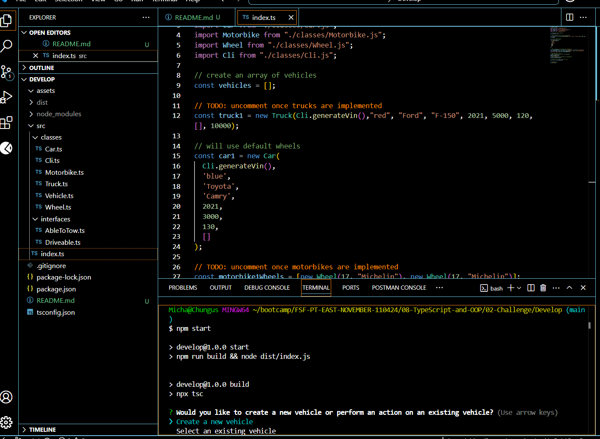

# Vehicle Cli

## Description

Vehicle Cli is a command-line application that allows users to create or select existing vehicles and interact with them through a series of actions. The app demonstrates object-oriented design and provides an engaging way to practice modifying and expanding an existing codebase.

Users can create different vehicle types including cars, trucks, and motorbikes, and perform various actions with each vehicle. This tool is ideal for developers looking to build and work with object classes while improving command-line interaction skills.

## Table of Contents

- [Installation](#Installation)
- [Usage](#Usage)
- [Screenshot](#Screenshot)
- [Walkthrough Video](#Walkthrough-Video)
- [Deployment](#Deployment)
- [Contribution](#Contribution)
- [Tests](#Tests)
- [License](#License)
- [Questions](#Questions)

## Installation

To install and run the application locally:
git clone https://github.com/hazyplebian/VehicleCli
cd vehicle-builder
npm install

## Usage

Invoke the application from the command line using:
npm start

## Screenshot

## Walkthrough Video
https://drive.google.com/file/d/1jnQZx3_Wk_WF7tki-HuRFgcGAuWOJRzH/view

## Deployment

This project runs entirely through the command line and is not deployed to a live environment. Clone the repository and run it locally.

## Contribution

Contributions are welcome! If you'd like to expand this project with more vehicle types or actions, feel free to fork the repo and submit a pull request.

## Tests

To test the functionality, run the app and go through both the Create Vehicle and Select Existing Vehicle flows, ensuring all inputs and actions work correctly.

## License

This project is licensed under the BSD license.

## Questions

If you have any questions, please contact me at michael.mangieri@yahoo.com.

You can find more of my work at [github.com/hazyplebian]
